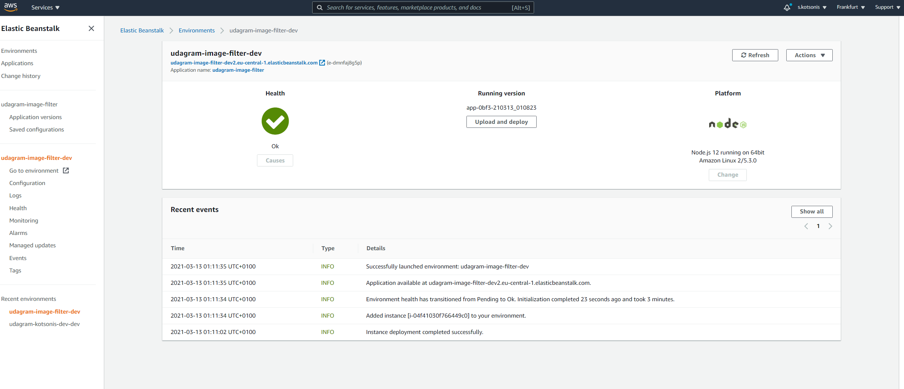
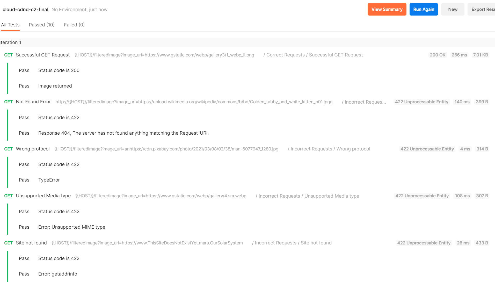

# Udagram Image Filtering Microservice
# Project 2 of the Udacity AWS Cloud Developer Nanodegree

The Image Filtering Microservice, the final project for the course 3 **Full Stack Apps on AWS** is is a Node-Express application which runs a simple script to process images.

## Getting Started
To set up and run the code in this repository, follow the instructions below.
### Download repository
 Clone the repository and install dependencies

```shell
	git clone https://github.com/kotsonis/udagram-image-filter.git
	cd udagram-image-filter
	npm run dev
```
### Setup Node Environment

You'll need to create a new node server and spin it up. Open a new terminal within the project directory and run:
```shell
	npm i
	npm run dev
```

## Project tasks / Results

### Task 1: Create a new endpoint in the server.ts file

Task was to create an endpoint `/imagefilter` which uses query parameter `image_url` to download an image from a public URL, filter the image, and return the result.

The sub-tasks that will need to be performed in this endpoint are:
1. Check if url given is valid and reachable
2. filter the image
3. Send back image and delete the temporary file that was created

### Solution
The code that was implemented can be found in [server.ts](src/server.ts) and [utils.ts](src/utils/utils.ts).

The specific solutions and rationale behind are given below:
#### Check if URL given is valid and reachable
To check the URL, the best way is to fetch that URL and check the response. If the URL is valid though, sending a GET request would mean receiving the file also, so it would take time and waste network bandwith. 

As a solution, we only send a HEAD request and check it. To do this, we rely on the [node-fetch](https://www.npmjs.com/package/node-fetch) npm library.

We encapsulate the request within an `async` function, so that the Promise returned can be used in subsequent steps with an `await` (to make sure we are both reactive but also follow the correct flow). Note that if the URL is malformed or unreachable, an exception is thrown.
The function implemented is given below:
```typescript
import fetch from 'node-fetch'; 
async function check_image_url(image_url:any) {
    let response = await fetch(image_url, { method: 'HEAD' })
    if (response.ok) {
      return image_url
    } else {
      console.log(`tried ${image_url}, Got ${response.status}, ${response.statusText}`)
      throw new Error(`Invalid image_url ${image_url}: ${response.status}, ${response.statusText}`);
    }
}
```
#### Filter the image and return it to the requestor as an attachment

We are already provided with a function that function that uses the JavaScript Image Manipulation Program [jimp](https://www.npmjs.com/package/jimp) to perform retrieve the image and perform operations.
The provided implementation however did no exception handling, which means that our nodejs app would hang and return no response if `jimp` would throw an exception.
Solution was to wrap the operations within a `try/catch` clause, so that we gracefully continue. The implemented function is shown below:
```typescript
try {
    const photo = await Jimp.read(inputURL);
    const outpath = '/tmp/filtered.'+Math.floor(Math.random() * 2000)+'.jpg';
    await photo
    .resize(256, 256) // resize
    .quality(60) // set JPEG quality
    .greyscale() // set greyscale
    .write(__dirname+outpath, (img)=>{
        resolve(__dirname+outpath);
    });
} catch(e) {
    console.log(`filterImageFromUrl: got error ${e}`);
    reject(e)
}
```
#### Send back image and delete the temporary file that was created
This was initially tricky, due to Javascript asynchronous operation. We need to make sure that the operations are performed in sequence, otherwise we would try to delete the file before it is created or sent...
Solution is simple though, once we look at the express.js Response class documentation. We implement the function `res.sendFile(path [, options] [, fn])` and create an anonymous function to pass as the `fn` argument. As per express.js, *"The method invokes the callback function fn(err) when the transfer is complete or when an error occurs."*, so this suites us fine.

Code implemented for the endpoint and file deletion is shown below:
```typescript
app.get('/filteredimage', async (req: Request, res: Response, next: NextFunction ) => {
    let { image_url } = req.query;
    try {
      let valid_image_url = await check_image_url(image_url)
      let processed_image = await filterImageFromURL(valid_image_url)
      res.status(200).sendFile(processed_image, (err:Errback)=>{
        if (err) {
          next(err);
        } else {
          deleteLocalFiles([processed_image])
        }
      })
    } catch (e) {
      // catch any exceptions from check_image_url, filterImageFromURL, and deleteLocalFiles (amongst others)
      res.status(422).send({message:`${e}`})
    }  
  });
```

### Deploying the system on AWS

We used [AWS Elastic Beanstalk](https://aws.amazon.com/elasticbeanstalk/) to deploy our node.js environment to the cloud, following the below steps:
1. We have to install the [AWS Command Line Interface](https://aws.amazon.com/cli/?nc2=type_a) and initialize it with our credentials.
2. We install the [Elastic Beanstalk command line interface](https://docs.aws.amazon.com/elasticbeanstalk/latest/dg/eb-cli3-install.html#eb_cli3-install-with-pip)
3. Build the nodejs RESTapi with `npm run build` 
4. Initialize the Elastic Beanstalk application with `eb init` and modify the `config.yml` file for the `deploy` command
5. Create the Elastic Beanstalk environment with `eb create`

Our environment was spun-up and running on AWS. Below screenshot from AWS


## Testing our RESTapi
[Postman](https://www.postman.com/) was used for testing our RESTapi. The tests created can be found in [cloud-cdnd-c2-final.postman_collection.json](cloud-cdnd-c2-final.postman_collection.json).
A screenshot of the tests and their result is shown below:


### Refactor the course RESTapi

If you're feeling up to it, refactor the course RESTapi to make a request to your newly provisioned image server.

### Authentication

Prevent requests without valid authentication headers.
> !!NOTE if you choose to submit this, make sure to add the token to the postman collection and export the postman collection file to your submission so we can review!

### Custom Domain Name

Add your own domain name and have it point to the running services (try adding a subdomain name to point to the processing server)
> !NOTE: Domain names are not included in AWS’ free tier and will incur a cost.
